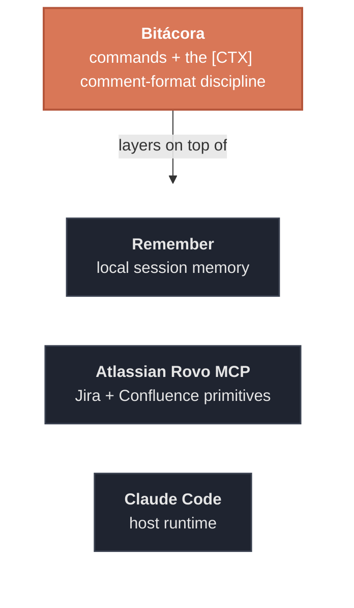

# Bitácora (plugin)

Jira-aware workflow layer for Claude Code. **Phase 1:** `/bitacora:handoff` and the
`[CTX]` comment-format discipline. Every bit of context, logged.

## Integrations

Bitácora runs on Claude Code alone. Both integrations below are **optional** — each one
enriches the handoff, and the workflow degrades gracefully when it's missing.



- **Remember** plugin (local session memory) — handoff delegates the consolidated local
  scratch to it. Without it, the scratch is printed to screen for you to save manually.
- **Atlassian Rovo MCP** with read/write to your Jira — for writing the `[CTX]` comments.
  Without it, handoff runs local-only: it still drafts and shows each comment, it just
  skips the Jira write.

## Commands

| Command | What it does |
|---------|--------------|
| `/bitacora:handoff [KEYS...]` | Reconstruct the Jira tickets touched this session, draft a `[CTX]` status comment for each (confirm before writing), and save one consolidated local scratch via Remember. Pass ticket keys to force the set. |
| `/bitacora:help` | Print the Bitácora command reference — shipped commands and the planned roadmap. |

## Optional: the shorter `/bit:` alias

Command namespace equals the plugin name, so commands are `/bitacora:…` by default.
For the shorter `/bit:…` forms, copy the bundled aliases into your personal commands
dir (one-time, per machine):

```bash
mkdir -p ~/.claude/commands/bit
alias_dir="$(dirname "$(find ~/.claude/plugins -path '*bitacora/alias/bit-handoff.md' | head -1)")"
cp "$alias_dir/bit-handoff.md" ~/.claude/commands/bit/handoff.md
cp "$alias_dir/bit-help.md"    ~/.claude/commands/bit/help.md
```

Then `/bit:handoff` and `/bit:help` run the same workflows as their `/bitacora:…` forms.

## The `[CTX]` format

See [`docs/JIRA_AGENT_COMMENT_FORMAT.md`](../../docs/JIRA_AGENT_COMMENT_FORMAT.md). The
operational source of truth is the `jira-comment-format` skill; `scripts/validate-ctx.sh`
classifies any comment as `compliant` / `malformed` / `not-in-format`.

## Safety

Draft → show → confirm → write, always. No auto-update, no telemetry. Local scratch is
written first so Jira-write failures never lose mid-task detail.
